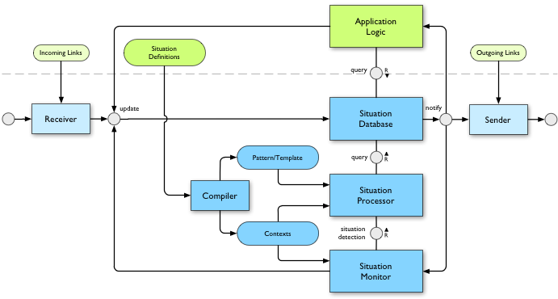
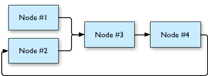
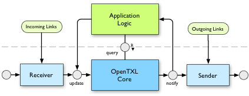

# OpenTXL Architecture

## Application & Framework

Since OpenTXL is not a stand-alone application, but a framework for the processing of spatial situations, it needs to be embedded into another application. This application defines the use-case, i.e. the framework is to be configured for a certain purpose. This configuration is done by the specification of definitions of situations and the link to other applications that use this framework. Additionally, the application can cooperate with the framework by sending information to the OpenTXL framework, as well as reacting to changes or searching the existing data. 

## Situation Database

The situation database is the central component of the framework. In this database all necessary information of the OpenTXL data model is stored. The database offers functions such as `update`, `query` and `notify`. However, `notify` is not a function, but rather an interface that notifies external components about changes.

### Update

`update` is used to update statements within a context. For a context this is done by marking the spatial situations within a temporal interval as deleted and replacing them by new ones.

### Notify

When a call of `update` modifies a context, a message is sent to registered components to notify them of the modification. This message contains the context and the revision number, which again is used to determine what has changed.

The database only transmits a message, when the context changed. If existing data is replaced with identical data, during an update, there is no notification created.

Similarly, when a component receives a notification message, stating that a context changed, it checks whether this change results in a change of its own state and only in such a case it performs the `update` operation.  

### Query

Utilizing `query` the database can be searched for statements. In order to do so the query language SPARQL is used. Such a call returns a list of results. A single result consists of bound variables and a spatio-temporal-interval, in which the resulting values of the variables are valid (valid space).

## Situation Definitions, Compiler & Situation Processor

### Situation Definitions

By using the definition of a situation the valid time of a situation is determined. To do so, a pattern is stated that needs to be matched. The statement contained in the new situation is defined by a template. A definition of a situation is stated analog to a search query using SPARQL.

### Compiler

The compiler translates the definition of a situation made in SPARQL, in a pattern, a template, and a list of contexts.

### Situation Processor

The situation processor evaluates the definition of a situation by attempting to match the pattern. This is done by searching for the pattern in the database. In this process only the statements which belong to the context stated in the definition of the situation (and its children contexts) are evaluated. The result is a set of situations that are valid within the context of the situation definition.

## Situation Monitor

The result is sent to the database as an update of the situation definition for this context. If the evaluation of a situation definition results in a change in the state of the database, the situation monitor is notified. The situation monitor forwards the notification message to all situations, which depend on the context changed. These situation definitions are further updates, based on the previous context changes, if necessary.

## Sender, Receiver & Links

An application that utilizes the OpenTXL framework can exist by itself without interacting with other applications. The full potential of this framework evolves, however, if an application is connected to other applications. In this case, it is possible to derive new situations, whereas an update of a situation defined by one application can trgger changes in situations stated within the context of other applications.

Therefore, an application can be a part of a situation network. Looking at OpenTXL at this level, an application is a node, that provides certain contexts. These nodes are connected by unidirectional links. When there is a change within a context, which is supplied by a node, a message is sent to the nodes which are connected to this node.

From the point of view of an application these links are regarded as inbound and outbound links 

### Sender

A sender is configured with a list of outgoing links. This list defines which node supervises which context.

When the situation database provides a notification about the change of a context, the sender filters the connected nodes by context and sends information about the change to the relevant receivers.

### Receiver

A receiver accepts messages about changes of other nodes' contexts. When such a message is received a check is performed to see whether the sender is authorized to send messages within this context. If this check is passed, the message is handed over to the situation database.

